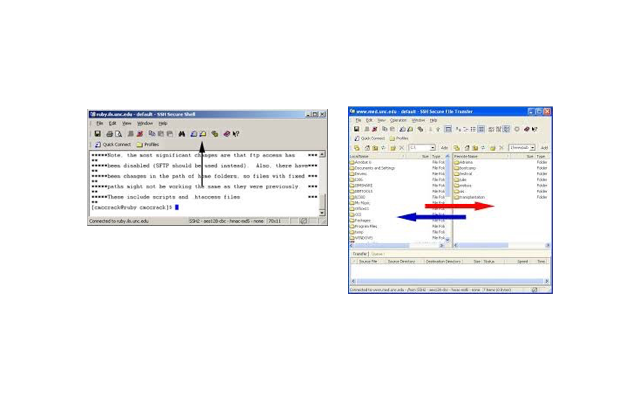

> ## Learning objectives {.objectives}
> * Learn how to transfer files
>   to or from the cluster
> * Learn how to download data from
>   the web

The data from Nelle's experiments is available online
at the following location:

~~~
https://github.com/clemsoncoe/hpc-workshop/blob/gh-pages/data-hpc.zip
~~~

Download this zip file to the Desktop on your own machine.
The first thing we'd like to do is transfer these
files into the Palmetto cluster.
How we do this depends on what operating system we run on our local machines.

## Using `scp` or a file transfer client

Mac OS X/Linux systems provide a command-line utility called
`scp` that is used to transfer files to and from remote computers.
The basic form of an `scp` command to transfer a file from the local
machine to a remote computer is:

~~~{.bash}
scp /path/to/source/file user@hostname:/path/to/destination/directory
~~~

~~~{.bash}
scp ~/Desktop/data-hpc.zip username@user.palmetto.clemson.edu:/home/username/
~~~

On Windows machines, a simple way to transfer files between
your local machine and the Palmetto cluster is via
the SSH client.
Simply click on the file transfer button as shown below.
This splits the screen in two halves,
so that you can drag files in your local machines
and copy them over to locations on the cluster:

## Using `wget`

~~~{.bash}
wget https://github.com/clemsoncoe/hpc-workshop/blob/gh-pages/data-hpc.zip
~~~
